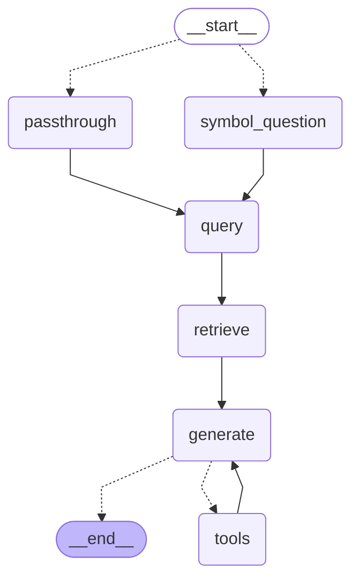

# LaTeX 기호 Parser  
  
## 1. 서론  
  
### 1-1. 프로젝트 주 흐름  


  
  
㉠ 질문자는 하나의 항을 보여주는 파란 박스를 클릭하던가,  
기호의 의미를 찾기 위해 빨간 박스를 클릭한다.  
  
㉡ 박스를 클릭하면 해당하는 LaTeX(KaTeX가 될 수도 있다. 이하 KaTeX도 표현)가 추출된다  
여기서 각 변수는 다음과 같다  
`symbol`: 고른 박스에 해당하는 LaTeX 문자열  
`context`: 고른 박스를 포함하는 파란 박스에 해당하는 LaTeX 문자열  
`page_title`: 해당 페이지의 제목(정의/정리)  
  
㉢ 박스를 클릭하면 박스의 대상을 물어보는 질문이 일정 형태에 맞춰 생성된다  
`question`: 형태에 맞춰진 질문  
`thread_id`: 사용자의 현재 스레드. 대화를 이어나갈 수 있다  
  
㉣ 질문이 생성되면 자동으로 챗봇에게 질문하게 되고,  
이후 추가 질문이 있으면 보통의 챗봇처럼 대화할 수 있다  
`question`: 이후의 질문도 이 변수다  
  
{아직 미구현}  
㉤ 누를 수 있는 것 중 기호나 정의/정리 안의 단어라면  
그것을 의미하는 문서의 페이지로 옮길 수 있다  
이것이 곧 digital garden처럼 작동한다  
  
㉥ 질문자가 원한다면 페이지가 옮겨도 기존 `thread_id`에서의 맥락을 이어받은채로  
챗봇과의 대화를 이어나갈 수 있다.  
당연히 기호 클릭 등에 의한 질문도 계속 이어나갈 수 있다  
  
&nbsp;  
  
### 1-2. 과제 사용 개념  
  
이번 과제는 **데이터를 불러와서 → LLM을 추가 내용으로 학습시키고  
→ 이를 토대로 답변을 생성하게 하는** 과정이었다.  
이를 **LangGraph 구조로 연결하고 → LangSmith를 통해 평가하며  
→ FastAPI로 연동**하였다  
  
| 구분        | 수행한 내용                                                       | 핵심 개념       |
| --------- | ------------------------------------------------------------ | ----------- |
| RAG       | LLM 연동, 학습 데이터 호출/청킹/임베딩/Chroma 인덱싱,<br>프롬프팅 후 알맞은 답변 생성의 흐름 | 외부 지식 연동 흐름 |
| LangGraph | 추후 업데이트 (아직 더 넣을 개념들이 있을지도)                                  |             |
| LangSmith |                                                              |             |
| FastAPI   |                                                              |             |
  
---  
  
## 2. 과제 진행 흐름  
  
```text  
(RAG 데이터 저장하고 불러오는 기반)  
env 파일 로딩  
→ md 파일 로딩/청킹/임베딩/인덱싱  
→ chroma_db에서 데이터 가져오는 retreiver 정의  
  
(답변 생성 파이프라인 설계)  
박스 클릭 판단  
→ 박스 클릭 시/클릭 안 할 시의 질문 전달 및 dictionary화  
→ retreiver를 통해 chroma_db에서 답변에 필요한 정보 습득  
→ 불러온 정보에 따라 프롬프트 작동  
→ llm 연동 후 답변 생성  
→ 필요하다면 툴 호출을 반복하여 최종 답변 생성  
  
(LangGraph로 파이프라인 작동)  
State 클래스 정의  
→ 들어온 State에 대해 node 함수들이 Graph에 따라 작동  
→ 답변 생성에 문제가 있을 시 툴 함수 호출되도록 유도  
→ WikipediaLoader 연결하여 정보 습득  
→ 컴파일 후 체크포인터 생성  
  
(FastAPI 연동)  
여긴 조금 더 고민  
```  
  
  
  
---  
  
## 3. 프롬프트 목표 데이터  
  
다음과 같이 세 가지 데이터를 사용하는 것을 목표로 한다.  
대신 프롬프트를 읽는 데는 순서가 없다는 것을 염두에 두자  
  
### 3-1. Wikipedia (tools.py)  
  
```python  
@tool  
def wiki_search(query: str) -> str:  
    """로컬 문서에 없는 수학 개념/기호를 영어 위키피디아에서 검색한다.  
    로컬 검색 결과가 질문에 답하기에 부족할 때만 사용하라."""  
    try:  
        loader = WikipediaLoader(query=query, lang="en", load_max_docs=3)  
        docs = loader.load()  
        return "\n\n".join(doc.page_content for doc in docs)  
    except Exception as e:  
        return f"위키피디아 검색 실패: {e}. 검색 없이 아는 범위에서 답하거나, 실패했다고 사용자에게 알려라."  
```  
  
**사용 방법**:  
- llm이 3-3의 문서로도 `generate`에서 대답을 만들지 못 한다면,  
- `AIMessage`는 `'type': 'tool_call'`을 통해 tool 호출  
- 이후 `wiki_search` 함수에서 `WikipediaLoader`를 통해 `ToolMessage` 생성 후 str로.  
  
**사용 이유**:  
- 가장 많은 수학 정의/정리에 대한 설명이 들어있음  
- 3-3의 로컬 문서에서 부족한 부분을 무슨 경우가 있더라도 대답할 수 있음  
  
&nbsp;  
  
### 3-2. 기호 다의성 판별 전용 md 파일 (미구현)  
  
(재밌을 것 같은) **사용 방법**:  
- 정의/정리랑 기호 설명을 다른 metadata로 넣고  
- `vectorstore.as_retriever(..., search_kwargs={"k": RETRIEVER_K, "메타데이터": "종류"})` 같은 식으로 구분한다  
- 그리고 prompt에 다른 { } 위치에 집어넣고, tools.py로 가는 조건을 생각해본다  
- 기호 md 파일은 50개 정도 넣는다  
  
**사용 이유**:  
- 사실 어느 문서든 여러 기호에 대한 이야기는 많지 않음  
- `question`과 `context`에 따라 기호의 의미는 무궁무진함.  
  → 그것을 구분해 줄 필요가 있음  
- 기호의 설명과 정의/정리의 설명을 같이 할 수 있다  
  
&nbsp;  
  
### 3-3. 정의/정리 md 파일 (ingest.py)  
  
```python  
    md_paths = sorted(glob(MD_GLOB, recursive=True)) # 테스트용  
    md_docs = []  
    for p in md_paths:  
        md_docs.extend(TextLoader(p, encoding="utf-8").load())  
  
    docs = md_docs  
```  
  
**사용 방법**:  
- config.py를 통해 문서 디렉토리를 설정하고  
  → TextLoader로 리스트에 추가한 후,  
  → 청킹하고, 임베딩한 후, Chroma에 인덱싱  
  
**사용 이유**:  
- tools.py까지 안 가고 훨씬 빠르게 대답 생성 가능  
- ==**내가 공부한 것을 집어넣은만큼 답변이 빨라지고 이해가 깊어지는  
  나만의 digital garden 생성 가능**==  
  
  
---  
  
## 4. 파일 역할 설명  
  
### 4-1. scripts/  
  
#### ㄱ. ingest.py  
  
md 파일을 RAG 데이터로 쓰기 위한 파일  
  
**전체 흐름**  
→ md 파일 로딩 → 청킹 → 임베딩 → 인덱싱 등 일반적인 RAG 데이터를 위한 조치  
  
**특이사항**  
- md 파일의 변경이 있을 경우 실행해줘야 하는 파일  
- 이후 chroma_db/에 Vector 데이터베이스가 저장되도록 함.  
- 주소는 src/config.py의 `MD_GLOB` 변수에 따라 설정됨  
- chroma_db/의 파일은 .gitignore에 포함  
- 그 외에 한 번 실행하면 변경사항이 없을 시 실행 필요 없음  
  
**앞으로의 과제**  
- 기호 다의성 판별 전용 md 파일 추가  
- `metadata`로 정의/정리와 기호를 구별하는 항목 추가  
- 아직 `sys.path` 이해 부족. 최상위 디렉토리에서 문제 없이 실행되게 문법 교체 필요  
- 현재 인덱싱시킬 수 있는 파일의 수가 너무 적음. batch 등을 이용해서 늘리는 것도 중요한 과제  
  
&nbsp;  
  
###  4-2. src/  
  
#### ㄱ. config.py  
  
공용으로 쓰이는 변수를 정의하는 파일  
  
**전체 흐름**  
→ env 파일 로딩 → 임베딩 모델 연결 → 그 외 변수들 수정이 용이하도록 정의  
  
&nbsp;  
#### ㄴ. retriever.py  
  
Vector 데이터베이스에서 질문과 관련된 데이터를 불러오는 파일  
  
**전체 흐름**  
→ ingest.py와 동일한 임베딩 모델 호출 → chroma_db/에서 유사도 기반 데이터 불러오고 return  
  
**앞으로의 과제**  
- retriever를 두 개 만들어 정의/정리와 기호 데이터 선택용으로 사용  
- 기호용 retriever는 유사도 기반 추천이 필요하지 않아 보임. 같은 LaTeX 기호 들어가면 추천  
  
&nbsp;  
  
#### ㄷ. node.py  
  
LangGraph 형태로 작동할 함수들을 정의하는 파일  
  
**전체 흐름**  
→ `route`로 박스 클릭 질문 판단. 박스 클릭 시 `state`의 `symbol`이 채워지므로 이를 통해 판단  
→ `symbol_question`에서 박스 클릭 시의 질문 생성, `passthrough`로 일반 질문 시 통과  
→ `query`에서 `"messages"`에 합쳐질 질문 dictionary를 return  
→ `retrieve`에서 retriever.py에서 호출한 retriever 이용하여 답변 생성 후,  
`"documents"`랑 `"sources"` 정의  
→ `generate`에서 프롬프트 설정, `llm`에 연동 후 `"messages"`로 추가  
이 과정에서 `TOOLS` 호출 존재  
  
  
**특이사항**  
- 일반적으로 `route`, `symbol_question`, `passthrough`, `query`는  
  한 함수로 표현할 수 있으나, LangGraph 문법 연습 겸 이렇게 표현  
- `"sources"`가 중복되는 현상이 있어 `list(dict.fromkeys(sources))` 사용  
  
**앞으로의 과제**  
- 프롬프트에 세 가지 종류의 문서를 유동적으로 볼 수 있도록 설계  
  
&nbsp;  
  
#### ㄹ. graph.py  
  
node.py에 적용할 함수들을 그래프로 연결  
  

  
**전체 흐름**  
→ `State` 클래스 정의  
`messages`: 지금까지의 대화 내용 저장  
`documents`: RAG에서 가져온 내용 저장  
`sources`: RAG에서 가져온 내용들의 출처 저장  
나머지 변수의 설명은 기존과 같음  
→ node.py 함수에 대응하는 노드 생성  
이 과정에서 tools.py의 `TOOLS`를 통해 `ToolNode`도 생성  
→ 설계에 맞게 edge 연결  
조건부 edge를 사용하고, `tool`을 위한 루프에 가까운 edge 구조도 생성  
`tools_contion`을 보고 다시 루프를 돌거나 `END`로 가는 구조  
→ 컴파일 후 `InMemorySaver`로 체크포인터 생성  
  
**특이사항**  
- `messages: Annotated[list, add_messages]`  
  메시지가 계속 쌓일 수 있도록 `Annotated`와 `add_messages` 기능 사용  
  
**앞으로의 과제**  
- `InMemorySaver`대신 `SqliteSaver`를 통해 대화를 영속화 및 관리  
  
  
&nbsp;  
  
#### ㅁ. tools.py  
  
`llm`이 사용할 tool들을 정의하는 파일. 당장은 Wikipedia 검색 기능 중심  
  
**전체 흐름**  
→ 툴 함수를 호출하는 조건 프롬프트 정의  
→ WikipediaLoader를 통해 호출 후 결과 return  
→ 예상치 못한 오류 발생을 대비해 Exception 상황 설정  
  
**특이사항**  
- `lang="en"`로 설정하여 개인적으로 수학에 걸맞다고 생각하는  
  대화는 한국어, 수학 개념은 영어인 상황이 되도록 꾀함  
- 실제로 특정 `thread_id`에서 알 수 없는 오류가 발생한 적 있다  
  이후 해당 thread는 `InMemorySaver`로 인해 다시 작동 불가  
  
**앞으로의 과제**  
- Wikipedia 결과인데도 불구하고 `"sources"`가 로컬 문서로 존재하는 상황 발견  
  위키 문서 URL을 `"sources"`에 담고,  
  retriever는 어차피 로컬 문서를 탐색하므로 Wikipedia 관련 내용만 나오도록 return하는 것 목표  
  
&nbsp;  
#### ㅂ. schemas.py  
  
main.py에 쓸 `BaseModel`을 통한 클래스 생성  
`Pydantic`을 사용하므로 타입 표기를 전부 해야 한다  
  
&nbsp;  
  
### 4-3. test/  
#### ㄱ. test.py  
  
파이프라인의 각 단계가 잘 작동하는지 확인하는 파일  
  
**전체 흐름**  
→ 특정 키워드에 대해서 retreiver의 output을 본다  
→ 같은 키워드에서 node.py의 함수에 대해서도 retreive가 잘 되는지 본다  
→ md 파일에 '있'는 주제에 대해 답변을 생성할 때 `tool_calls`를 관찰한다  
→ md 파일에 '없'는 주제에 대해 답변을 생성할 때 `tool_calls`를 관찰한다  
→ graph가 잘 생성되었는지 `.draw_mermaid()`를 통해 확인한다  
→ 전체 파이프라인이 잘 돌아가는지 임시 `State`를 집어넣는다  
  
**특이사항**  
- 중간 과정에서의 output이 무엇인지 잘 생각해야 한다  
  대표적으로 `generate` 함수는 graph.py에서 부르기 전까진 리스트 딕셔너리의 결과물일 뿐이다  
- `grandalf` 라이브러리를 쓰려고 했으나, mermaid 방식을 쓰는 것이 README.md 용으로 좋을 것 같았다  
- md 파일이 바뀔 때마다 ingest.py를 실행시켜야 한다  
  
**앞으로의 과제**  
- `assert` 문법을 사용해 결과물이 잘 나오는지 확인할 수 있도록 할 것이다  
- 다만 llm을 실제로 호출하는 부분이 있을 수 있는 문제를 생각해야 할 것이다  
- 스레드 관련 테스트도 넣을 것이지만, 같은 `thread_id`를 쓰면 오염되는 문제를 방지해야 한다  
  
  
&nbsp;  
###  4-4. 상위 폴더/  
#### ㄱ. main.py  
  
FastAPI를 이용해 받아들이고 내보낼 데이터를 결정하는 파일  
  
**전체 흐름**  
→ 앱 초기화 시점에 LangGraph 생성  
→ `QueryRequest`의 변수들을 State에 이식  
→ `thread_id`를 집어넣는 `config` 변수 포함  
→ 이후 LangGraph에 invoke한 후 나온 결과를 `QueryResponse` 형태로 return  
  
**특이사항**  
- `QueryResponse`의 `answer`는 `"messages"`의 마지막 부분만  
- 이때 AIMessage의 `.content`는 메시지 형태가 복잡하므로 `.text` 사용  
  
**앞으로의 과제**  
- 대화 세션을 조회 관리하는 기능 추가. 로그인 여부는 검토  
- 캐싱을 하여 기호 클릭한 질문에 대한 대답은 동일한 대답을 하도록 함.  
  이를 `req.symbol`로 구별  
  
&nbsp;  
###  4-X. 미구현  
#### ㄱ. eval.py  
  
LLM의 결과물이 잘 나오는지 확인하는 파일  
  
**목표**  
- LangChain 용도로 만들었던 것을 현재 프로젝트에 맞게 변형  
- judge 부분을 Claude API를 이용하는 방법을 사용한다  
- 앞으로 모델 흐름에 대한 모든 의문이 있으면 eval.py가 평가지표가 되도록 한다  
  
  
---  
  
## 5. 앞으로의 체크리스트  
  
- ~~에러 노트 적기~~  
-    sys.path 이해  
- ~~test.py 만들기 & 모든 결과 어느 부분인지 이해하고 싶다 & 어떻게 하면 맛있는 test.py를 만드는지 알고 싶은.~~  
-    assert를 넣어보자  
- ~~try/except 오늘 오류 난 곳 넣어보기~~  
-    eval.py 만들기  
-   Haiku 드디어 이식  
-    wiki_search URL 반환  
- ~~README를 쓰며 주간 프로젝트 완료~~ (근데 아마 다음 주 주간 프로젝트가 양자화일거임)  
-   스트리밍 응답  
-   프롬프트 사다리 구조 좀 더 생각하고 적어보기. 너가 말한 "문서가 관련 있으면 문서에 근거해라. 문서가 무관해도 표준적인 수학 내용이면 바로 답해라. 단, **이 문서 특유의 표기로 보이거나, 문서에 있어야 할 정의가 검색 결과에 없거나, 특정 문헌·인물·최신 내용을 묻는 경우** wiki_search를 써라."의 원리를 조금 더 생각. 아마 9번의 것과 같이 생각해야 할 일.  
-    md에 대한 생각. 솔직히 개념이 들어간 md 파일 빼고 다의성 판별 전용 사전 md만 직접 만들어서 하고 싶었는데, md 파일 대답의 속도 차이를 봐버림. 결국 내 목표가 또 다시 바뀜. 기호 파싱 LaTeX인 것은 변함 없지만, 동시에 내 수학노트이기도 한 것. 수학노트를 계속 추가할 수 있는 구조의 기호 파싱 LaTeX. 없는 것은 여전히 위키피디아로. 아무튼 이 단계에서 다의성 판별 전용 사전 md 넣을거  
-   기호 클릭용 이중 검색  
-    대화 영속화 + 세션 관리  
-    캐싱  
-    온디맨드 위키피디아 인제스트  
-    위키피디아 마크업 파싱  
-   최종 프로젝트 완료  
  
---  
  
## 6. 최종 회고  
  
RAG라는 기능을 이용해 흥미로운 프로젝트를 진행하고자 했지만,  
이러한 LLM 응용 애플리케이션의 전체 흐름, 더해서 서비스와 그 서비스의 평가 흐름까지 알 수 있는 경험이였다.  
  
솔직히 RAG를 설계하고 응용하는 것 자체도 어려운 일이였지만, md 파일을 청킹하고 RAG 식으로 LLM에게 보여주어 답변을 얻는 과정을 살펴보면서 실제 배포되는 서비스에서 현재 상용화된 AI 연결의 원리를 알게 되었고, 이번 프로젝트에서 하면 좋을 여러 응용을 떠올릴 수도 있었다.  
  
또한 LangChain 뿐만 아니라 LangGraph 등으로 표현하여 프로젝트가 흘러가는 것을 보면서,  
오히려 프로젝트가 어떤 식으로 작동해야 할지 생각할 수 있었다.  
특히 LangGrap에서 Tool Call이 작동하는 원리는 나에게 최종 목표가 무엇이 되어야 하는지 영감을 안겨주었다.  
  
(아직 계속...)  
